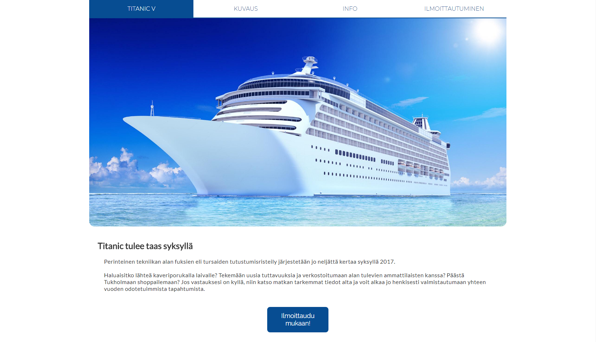

# Titanic cruises

This is the website for our Titanic-cruises. Users can read about the story of how it all got started and a TLDR of each cruise. They can also vote when the next cruise should be and after the date of the departure has been chosen they can also sign up for the cruise. It all started out as a school project and it turned into an ongoing personal project.

### Development

The frontend was done with HTML, CSS, JS and jQuery. Backend was created with PHP and the data was stored in a MySQL database.

### Author

 * **[Mirko Nowak](https://www.linkedin.com/in/mirkonowak/)**
